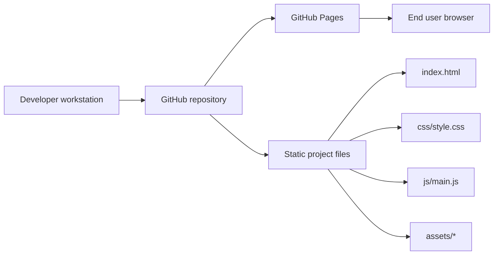

# ULDA Notes

ULDA Notes is a bachelor project repository for a secure private notes web application.

## Project description
The project is a web application for creating and storing private notes with a focus on secure authorization and data protection.

At the current stage, the repository contains a static landing page for presenting the bachelor thesis project, along with project documentation, generated technical documentation and deployment instructions.

## Technologies
- HTML
- CSS
- JavaScript
- Node.js
- npm
- GitHub Pages
- JSDoc
- ESLint
- Stylelint
- HTMLHint
- TypeScript (`checkJs` mode)

## Architecture

ULDA Notes is currently implemented as a static client-side web project deployed through GitHub Pages.

### Main structural elements
- **Web server** — GitHub Pages
- **Application server** — not used in the current implementation
- **Database** — not used in the current implementation
- **File storage** — static project files in the repository
- **Caching services** — not used
- **Other components** — GitHub repository, documentation files, npm scripts, generated technical documentation

### Architecture diagram



### Component description
- `index.html` — defines the page structure and content sections
- `css/style.css` — contains styling, layout, typography and responsive design rules
- `js/main.js` — implements client-side interaction logic
- `assets/` — stores icons, images and visual assets
- `docs/` — contains project, deployment and maintenance documentation
- `generated-docs/` — contains automatically generated code documentation

## Developer quick start

This section describes how a new developer can start working with the project from a clean operating system environment.

### Required software
Install the following software before starting:
- Git
- Node.js 20+
- npm
- Code editor (recommended: Visual Studio Code)

### Clone the repository
```bash
git clone https://github.com/MuckLuck2005/ulda-notes.git
cd ulda-notes
```

### Install dependencies
```bash
npm install
```

### Run the project in development mode
```bash
npm run dev
```

### Run all checks
```bash
npm run check
```

### Preview production-like version
```bash
npm run prod:preview
```

### Generate project documentation
```bash
npm run docs:generate
npm run docs:archive
npm run docs:check
```

## Basic commands
- `npm run dev` — run a local development server
- `npm run check` — run linting and type checking
- `npm run build` — run build verification
- `npm run prod:preview` — preview the project in a production-like mode
- `npm run docs:generate` — generate HTML documentation from JSDoc comments
- `npm run docs:archive` — create an archive with generated documentation
- `npm run docs:check` — check documentation quality

## Repository structure
- `assets/` — icons, images and additional visual materials
- `css/` — stylesheet files
- `js/` — JavaScript source files
- `docs/` — project documentation
- `generated-docs/` — generated technical documentation
- `reports/` — linting and analysis reports
- `.env.example` — example environment variables
- `.gitignore` — ignored files and folders
- `LICENSE` — project license
- `README.md` — main project overview
- `index.html` — landing page entry file

## Documentation rules

All public JavaScript functions in this project should be documented using JSDoc comments.

When updating or adding code, contributors should:
- describe the purpose of each public function;
- document parameters with `@param`;
- document return values with `@returns`;
- keep comments up to date when logic changes;
- verify documentation quality before commit.

Useful commands:
```bash
npm run docs:generate
npm run docs:archive
npm run docs:check
```

## Status
The project repository contains a documented landing page for the bachelor thesis project, deployment instructions, code documentation and maintenance materials for further development and support.
